# Rapport d'usage de l'IA — TP Angular (M1 MIAGE)

**Étudiant :** Thomas DELOUP (travail individuel)  
**Assistant IA principal :** Antigravity (moteur Gemini 3.8 Flash) en environnement IDE avec accès direct au workspace  
**Supervision méthodologique :** ChatGPT-5.6-sol / ChatGPT-6-sol (validation des choix d'architecture)  

---

# TP1 — Authentification et Profil

## Mission 0 — Cartographie de l'application

- **Objectif :** Cartographier l'architecture frontend/backend du projet fourni, identifier le composant racine, les routes, l'injection de `HttpClient`, le fonctionnement du proxy et distinguer les routes publiques des routes protégées par JWT sans modifier le code.
- **Prompt principal :**
  > « Mission 0 — Cartographier l’application  
  > Sans modifier le code au début, retrouver :  
  > - le composant racine ;  
  > - la configuration des routes ;  
  > - l’enregistrement de HttpClient ;  
  > - les modèles, services et pages ;  
  > - le mécanisme qui ajoute le JWT aux requêtes protégées.  
  > Produire un schéma annoté du flux lors d’un clic sur « Se connecter ». Ouvrir API_CONTRACT.md et distinguer les routes publiques des routes protégées. »
- **Plan proposé par l'agent :**
  1. Inspection de `frontend-starter/src/main.ts` et `app/routes.ts` pour identifier le bootstrap standalone et la garde `authGuard`.
  2. Traçage de `HttpClient` et analyse de l'intercepteur `auth.interceptor.ts`.
  3. Modélisation du flux de connexion `Composant → Service → HttpClient → Proxy (:3000) → Express → MongoDB`.
  4. Analyse comparative des endpoints dans `API_CONTRACT.md`.
- **Vérifications réalisées (étudiant) :**
  - Contrôle du démarrage du backend (`http://localhost:3000/api/health`) et de MongoDB Atlas.
  - Vérification du fichier `proxy.conf.json` redirigeant `/api/*` vers le port 3000.
  - Identification des routes publiques (`/health`, `/auth/login`, `/auth/register`) et protégées (`/users/me`, `/tracks`).
- **Erreurs rencontrées :**
  - Au premier lancement, la base MongoDB Atlas s'est créée avec le nom par défaut `test` car l'URI dans le fichier `.env` du backend ne spécifiait aucun nom de base après le slash (prompt associé : *« pourquoi ma base dans mon cluster mongo s'appelle test »*). J'ai corrigé manuellement l'URI dans `.env` pour cibler la base du projet.
- **Fichiers consultés (analyse pure) :**
  - `frontend-starter/src/main.ts`, `app/routes.ts`, `app/components/app/app.ts`, `app/shared/interceptors/auth.interceptor.ts`, `API_CONTRACT.md`.
- **Preuve de fonctionnement :**
  - Backend démarré, connexion vérifiée et cartographie validée.
- **Ce que je sais expliquer sans l'agent :**
  - **Flux de connexion :** Le clic déclenche `login()` dans le composant, qui appelle `AuthService.login()`, qui utilise `HttpClient.post()`. Le proxy redirige la requête vers Express sur le port 3000, qui vérifie les identifiants en base et renvoie un JWT.
  - **Routes publiques vs protégées :** Les routes d'authentification sont ouvertes ; toutes les autres exigent l'en-tête `Authorization: Bearer <token>` vérifié par le middleware Express `auth`.

---

## Mission 1 — Inscription, Connexion et Profil

- **Objectif :** Implémenter la gestion complète de session utilisateur : formulaires réactifs de connexion et d'inscription avec validation, stockage sécurisé du JWT en mémoire/localStorage, mise à jour réactive du profil via Signals, modification du nom avec `PUT /api/users/me`, et intercepteur HTTP 401.
- **Prompt principal (cadrage) :**
  > « Mission 1 — Inscription Connexion et Profil  
  > Compléter ou réécrire la partie utilisateur du frontend :  
  > - formulaires réactifs pour l’inscription et la connexion ;  
  > - validations et messages d’erreur compréhensibles ;  
  > - appels de /api/auth/register et /api/auth/login ;  
  > - sauvegarde du JWT côté navigateur, sans jamais l’afficher dans les logs ;  
  > - mise à jour du Signal currentUser ;  
  > - redirection après une connexion ou une inscription réussie ;  
  > - bouton de déconnexion avec nettoyage de l’état local ;  
  > - chargement de /api/users/me lorsque le profil est demandé ;  
  > - modification du nom avec PUT /api/users/me ;  
  > - gestion d’un 401, avec retour vers /login si le token est invalide ou expiré.  
  > Le composant ne doit pas appeler directement HttpClient : il passe par AuthService. Utiliser inject() et conserver une séparation claire entre interface, service et API.  
  > J'ai besoin de faire ça. Sans coder, proposes moi une implémentation. Après quand on codera, tu feras des tests pour chaque composants »
- **Prompt d'implémentation (supervisé par ChatGPT) :**
  > « Implémente la Mission 1 avec une gestion explicite des états loading/authenticated/anonymous, un intercepteur 401 idempotent et sans boucle, des méthodes strictement typées, des formulaires protégés contre les doubles soumissions, et des tests couvrant les succès, validations, erreurs 400/401/404/409, erreurs réseau, restauration de session et propagation des erreurs HTTP. Aucun token ne doit apparaître dans les logs, les erreurs ou les snapshots de test. »
- **Plan proposé par l'agent :**
  1. Définition des interfaces TypeScript strictes pour les requêtes et les réponses auth (`auth.models.ts`).
  2. Implémentation du service central `AuthService` piloté par des Signals (`currentUser`, `token`, `isAuthenticated`).
  3. Création de l'intercepteur HTTP fonctionnel pour ajouter le header `Authorization: Bearer <token>` et intercepter les erreurs 401.
  4. Création des pages de formulaires réactifs (`login-page`, `register-page`, `profile-page`) avec blocage anti-double clic et messages d'erreur ciblés.
  5. Rédaction d'une suite exhaustive de tests unitaires avec `provideHttpClientTesting()`.
- **Vérifications réalisées (étudiant) :**
  - Inscription d'un nouvel utilisateur et vérification de la création en base MongoDB Atlas.
  - Connexion avec le compte de démonstration (`demo@example.com` / `Demo1234!`), inspection du `localStorage` et du Signal `currentUser`.
  - Modification du nom dans le profil et vérification de la persistance après rafraîchissement.
  - Simulation d'un mot de passe incorrect et vérification de l'affichage de l'erreur 401 sans boucle de redirection.
- **Erreurs ou propositions rejetées :**
  - L'IA voulait charger automatiquement le profil dans le constructeur de `AuthService`. J'ai refusé car cela déclenchait des requêtes réseau parasites pendant les tests unitaires. J'ai créé à la place une méthode `initializeSession()` appelée explicitement dans `AppComponent.ngOnInit()`.
  - L'IA avait utilisé un `computed()` pour surveiller la valeur d'un `FormControl`. Un champ de formulaire n'étant pas un Signal, cela ne se mettait pas à jour ; j'ai corrigé avec une méthode dédiée `isUnchanged()`.
- **Fichiers modifiés :**
  - `src/app/shared/models/auth.models.ts` : interfaces pour l'utilisateur et les requêtes auth.
  - `src/app/shared/services/auth.service.ts` : gestion de session via Signals (`currentUser`, `token`), persistance `localStorage`, méthodes `login`, `register`, `logout`, `clearSession`.
  - `src/app/shared/interceptors/auth.interceptor.ts` : injection du header `Authorization` et déconnexion propre sur erreur 401 (hors route de login).
  - `src/app/components/login-page/` & `register-page/` : formulaires réactifs, validation mot de passe, messages d'erreurs, état de chargement anti-double clic.
  - `src/app/components/profile-page/` : affichage réactif, modification du nom et désactivation du bouton si le formulaire est inchangé.
  - `src/app/components/app/` : barre de navigation dynamique avec bouton de déconnexion.
  - Tests unitaires Vitest associés.
- **Preuve de fonctionnement :**
  - **Tests unitaires :** `npm test -- --watch=false` dans `frontend-starter/` (33 tests passants).
  - **Build :** `npm run build` réussi sans warning.
  - **Captures Network et visuelles :**
    - Connexion 200 OK : [`tp1_01_login_success_200.png`](docs/screenshots/tp1_01_login_success_200.png)  
      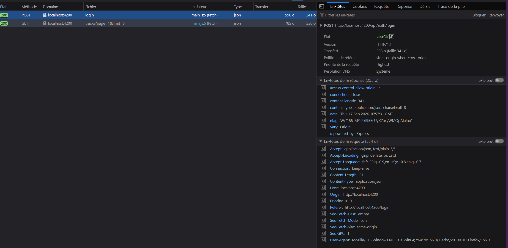
    - Connexion refusée 401 : [`tp1_02_login_failure_401.png`](docs/screenshots/tp1_02_login_failure_401.png)  
      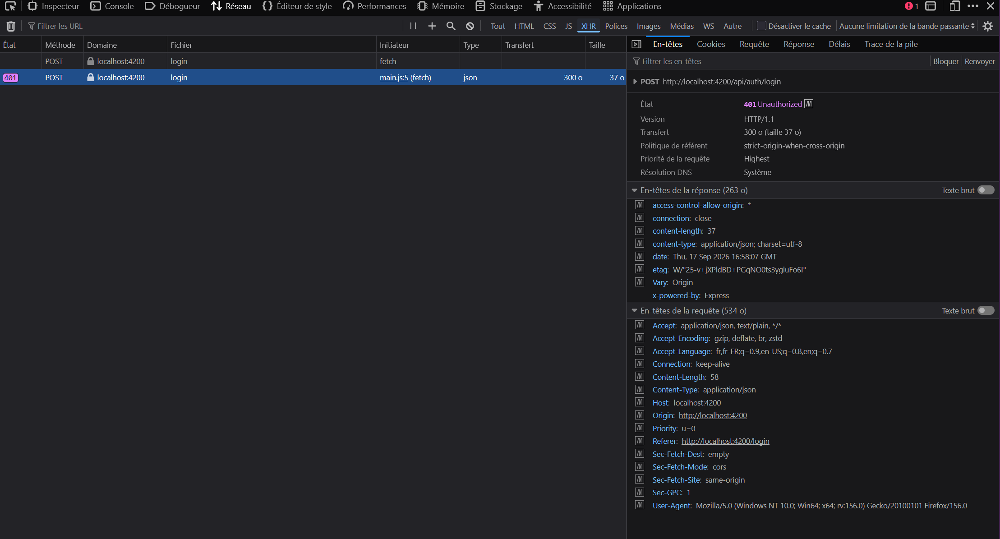
    - Récupération profil GET sous JWT : [`tp1_03_profile_get_jwt_200.png`](docs/screenshots/tp1_03_profile_get_jwt_200.png)  
      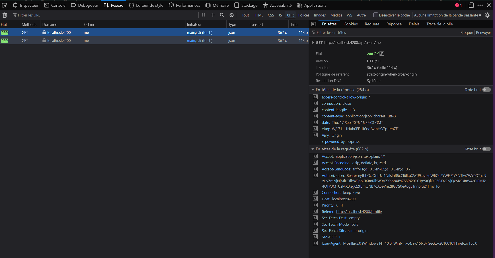
    - Modification profil PUT (en-têtes et token) : [`tp1_04_profile_put_headers_200.png`](docs/screenshots/tp1_04_profile_put_headers_200.png)  
      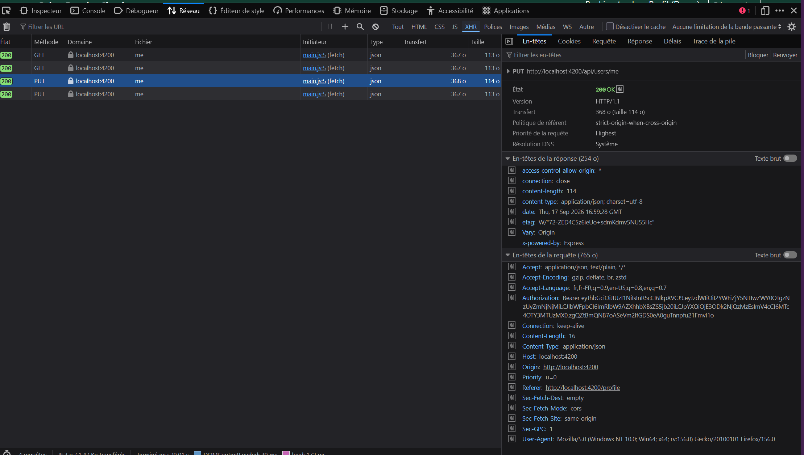
    - Modification profil PUT (payload JSON) : [`tp1_05_profile_put_payload.png`](docs/screenshots/tp1_05_profile_put_payload.png)  
      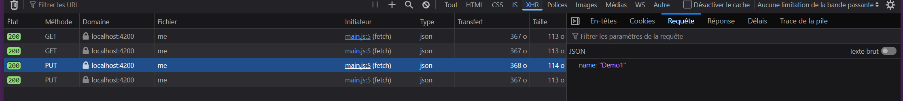
    - Modification profil PUT (réponse serveur 200) : [`tp1_06_profile_put_response.png`](docs/screenshots/tp1_06_profile_put_response.png)  
      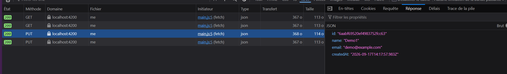
- **Ce que je sais expliquer sans l'agent :**
  - **Signal vs `localStorage` :** Le Signal est en mémoire RAM et réactif (met instantanément la vue à jour dès modification), mais s'efface au rechargement. Le `localStorage` est stocké sur disque par le navigateur pour persister la session, mais n'est pas réactif.
  - **Mise à jour du profil :** Le composant `profile-page.ts` appelle `authService.update()` qui émet `PUT /api/users/me`. Le backend met à jour MongoDB, et au retour 200, le signal `currentUser` est actualisé avec les nouvelles données.
  - **Pourquoi un service ?** Pour isoler la logique réseau et les types de l'affichage, permettant de tester le composant en mockant le service.

---

# TP2 — Bibliothèque Paginée, Upload et Streaming Audio

## Mission 2 — Bibliothèque paginée

- **Objectif :** Afficher les morceaux appartenant à l'utilisateur sous forme de bibliothèque paginée (5 morceaux par page par défaut), avec navigation « Précédent » et « Suivant » aux bornes, gestion des états loading/erreur/vide, et annulation des requêtes concurrentes.
- **Prompt principal :**
  > « GO Mission 2 uniquement : bibliothèque paginée.  
  > À partir du contrat et des fichiers réellement trouvés :  
  > - Implémente ou corrige TrackService.list(page, limit) pour envoyer réellement page et limit à GET /api/tracks.  
  > - Type la réponse d’après le contrat réel du backend ; ne devine pas ses propriétés.  
  > - Dans le composant bibliothèque, gère avec des Signals la liste, page, pages, loading et l’erreur.  
  > - Affiche les pistes avec @for, l’état vide avec @empty et le chargement avec @if.  
  > - Ajoute « Précédent » et « Suivant », désactivés aux bornes, ainsi que pendant une requête si nécessaire.  
  > - À chaque changement de page, déclenche une nouvelle requête serveur. N’implémente aucune pagination locale.  
  > - Gère les changements de page rapides pour éviter qu’une ancienne réponse HTTP n’écrase une page plus récente.  
  > - Ajoute ou complète les tests utiles : paramètres HTTP, navigation entre pages, boutons aux bornes, état vide et erreur.  
  > Ne travaille pas encore sur l’upload, le lecteur, les cards avancées ou Angular Material. Termine par les commandes de test et une liste de vérifications à faire dans Network, puis attends mon GO. »
- **Plan proposé par l'agent :**
  1. Typage de la méthode `TrackService.list(page, limit)` retournant `Observable<Page<Track>>`.
  2. Création des Signals réactifs dans `TracksPageComponent` : `tracks`, `page`, `pages`, `total`, `loading`, `error`.
  3. Implémentation de `load()` avec désinscription préalable (`loadSubscription?.unsubscribe()`) pour éviter les télescopages de requêtes.
  4. Template avec Control Flow natif Angular (`@for`, `@empty`, `@if`) et liaison des boutons aux bornes (`[disabled]`).
  5. Écriture des tests unitaires de navigation et de gestion des erreurs.
- **Vérifications réalisées (étudiant) :**
  - Contrôle dans l'onglet Network de l'émission effective de `GET /api/tracks?page=1&limit=5` et `GET /api/tracks?page=2&limit=5`.
  - Vérification de la désactivation du bouton « Précédent » sur la première page et du bouton « Suivant » sur la dernière page.
  - Clics rapides répétés entre les pages : aucune désynchronisation observée grâce à l'annulation des requêtes précédentes.
- **Fichiers modifiés :**
  - `src/app/shared/services/track.service.ts` : méthode `list(page, limit)` typée avec `Observable<Page<Track>>`.
  - `src/app/components/tracks-page/tracks-page.ts` : signaux réactifs, méthode `go()`, protection anti-collision.
  - `src/app/components/tracks-page/tracks-page.html` : template avec boucles `@for`, bloc `@empty`, alertes `@if`.
  - `src/app/components/tracks-page/tracks-page.spec.ts` : 8 tests unitaires dédiés à la pagination.
- **Preuve de fonctionnement :**
  - 44 tests frontend réussis.
  - **Captures Network et visuelles :**
    - Requête `GET /api/tracks?page=1&limit=5` et réponse JSON paginée : [`tp2_01_pagination_page1_network.png`](docs/screenshots/tp2_01_pagination_page1_network.png)  
      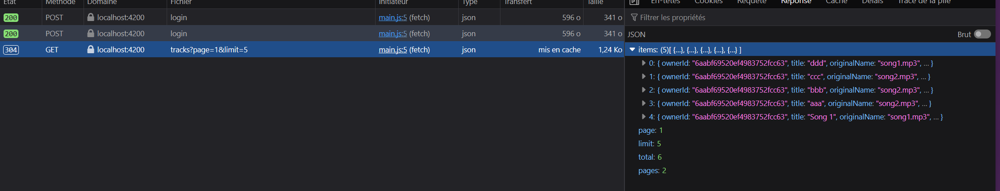
    - Requête page suivante `GET /api/tracks?page=2&limit=5` : [`tp2_02_pagination_page2_network.png`](docs/screenshots/tp2_02_pagination_page2_network.png)  
      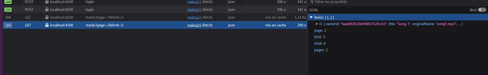
    - Boutons de navigation (bouton Suivant désactivé à la dernière page) : [`tp2_03_pagination_buttons_ui.png`](docs/screenshots/tp2_03_pagination_buttons_ui.png)  
      
- **Ce que je sais expliquer sans l'agent :**
  - **Pagination serveur vs pagination locale :** La pagination locale télécharge l'intégralité des données en mémoire dans le navigateur et les découpe avec `Array.slice()`. La pagination serveur ne transfère que les 5 morceaux de la page demandée (`skip` et `limit` en BDD), ce qui économise la bande passante et la RAM.
  - **Gestion des clics rapides :** En appelant `this.loadSubscription?.unsubscribe()` avant chaque nouveau chargement, on annule la requête en vol précédente et on évite qu'une réponse retardée n'écrase la page la plus récente.

---

## Mission 3 — Upload audio et création d'une piste

- **Objectif :** Permettre l'envoi de fichiers audio valides (MP3, WAV, OGG, M4A jusqu'à 25 Mo) via un formulaire multipart/form-data, avec validation préalable côté client, désactivation du bouton pendant l'envoi pour bloquer les doubles clics, et réinitialisation vers la première page après succès.
- **Prompts principaux :**
  - *Analyse (Mission 3A) :*
    > « Mission 3A : analyse uniquement. Ne modifie aucun fichier.  
    > Localise précisément, avec chemins de fichiers et noms de méthodes : le choix du fichier ; la création du FormData ; l’ajout des champs audio et title ; l’appel HTTP d’upload ; la requête audio authentifiée ; la récupération du Blob ; URL.createObjectURL() ; l’affectation de l’URL au lecteur <audio> ; la révocation de l’ancienne URL et la gestion de la destruction du composant ; l’intercepteur qui ajoute le JWT.  
    > Vérifie dans le backend les validations multipart et la manière dont le fichier audio est servi. Explique les deux flux, composant → service → HttpClient → API et API → Blob → ObjectURL → lecteur. Distingue clairement ce qui existe déjà de ce qui manque. N’affirme pas que la réponse est un streaming de bout en bout sans l’avoir vérifié dans le code. Attends mon GO. »
  - *Upload (Mission 3B) :*
    > « GO Mission 3B : amélioration minimale de l’upload existant. Sans réécrire le mécanisme actuel ni changer l’API :  
    > Ajoute côté frontend la validation du titre, du fichier, des formats réellement acceptés par le backend et de la taille maximale de 25 Mo avant l’appel HTTP. Vérifie que le FormData contient exactement les champs attendus audio et title. Ne fixe pas manuellement l’en-tête Content-Type du multipart. Affiche des erreurs compréhensibles pour les fichiers invalides et pour les erreurs serveur. Ajoute un état d’envoi ; désactive le bouton et empêche les doubles soumissions. Après succès seulement : affiche un message de réussite, vide le formulaire et recharge la première page depuis le serveur. Préserve les éventuelles pistes affichées en cas d’échec. Ajoute ou complète les tests couvrant fichier absent, type refusé, taille supérieure à 25 Mo, FormData, double soumission, succès et erreur HTTP. Présente les fichiers modifiés et les résultats des tests, puis attends mon GO. »
- **Plan proposé par l'agent :**
  1. Constantes de validation MIME et taille maximale (25 Mo) dans le composant.
  2. Construction de `FormData` avec les champs `audio` et `title` sans forcer manuellement le `Content-Type` (laissé au navigateur pour inclure le boundary).
  3. Gestion du signal `uploading` pour bloquer les doubles soumissions et afficher l'état d'envoi.
  4. Réinitialisation complète du formulaire et rechargement de la page 1 après succès 201.
- **Vérifications réalisées (étudiant) :**
  - Tentative de sélection d'un fichier `.txt` ou d'un fichier de plus de 25 Mo : blocage immédiat côté client avec message d'erreur clair sans requête HTTP inutile.
  - Upload d'un fichier audio valide : bouton désactivé pendant l'envoi, affichage du message de succès, formulaire vidé et apparition du nouveau morceau en tête de liste.
  - Vérification de l'enregistrement du fichier dans `backend/data/uploads/` et de la métadonnée dans MongoDB Atlas.
- **Fichiers modifiés :**
  - `src/app/components/tracks-page/tracks-page.ts` : constantes `ALLOWED_AUDIO_MIMES`, `MAX_AUDIO_FILE_SIZE`, validation client, gestion des signaux `uploading`, `uploadError`, `uploadSuccess`.
  - `src/app/components/tracks-page/tracks-page.html` : formulaire accessible avec bouton désactivé en cours d'envoi.
  - Tests unitaires dans `tracks-page.spec.ts`.
- **Preuve de fonctionnement :**
  - **Captures visuelles :**
    - Bouton d'upload désactivé avec état « Envoi en cours... » : [`tp2_04_upload_button_loading_ui.png`](docs/screenshots/tp2_04_upload_button_loading_ui.png)  
      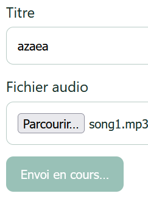
    - Message visuel de succès lors de l'ajout d'une piste : [`tp2_05_upload_success_message_ui.png`](docs/screenshots/tp2_05_upload_success_message_ui.png)  
      
- **Ce que je sais expliquer sans l'agent :**
  - **Pourquoi `FormData` plutôt que du JSON ?** Le format JSON ne transporte que du texte ou du Base64 (qui gonfle la taille du fichier de 33%). `FormData` permet d'envoyer des octets binaires bruts en `multipart/form-data`.
  - **Validation frontend vs backend :** La validation frontend sert le confort utilisateur (retour instantané). La validation backend est impérative pour la sécurité (évite les contournements via curl ou Postman).

---

## Mission 4 — Liste et lecture audio

- **Objectif :** Présenter les morceaux sous forme de cartes accessibles affichant leurs métadonnées, et permettre la lecture audio sécurisée via un appel `HttpClient` authentifié converti en `Blob URL`, avec arrêt propre, gestion des erreurs et révocation de la mémoire à la destruction.
- **Prompt principal :**
  > « GO Mission 3C : lecteur audio et présentation. Conserve la lecture authentifiée déjà existante et complète uniquement les points manquants :  
  > Présente les morceaux sous forme de cards responsives et accessibles, à partir des seules métadonnées réellement disponibles. Affiche le morceau en cours de lecture et une erreur audio compréhensible en cas d’échec. Vérifie qu’un changement de morceau révoque l’ancienne ObjectURL au bon moment. Révoque également l’ObjectURL finale à la destruction du composant. Vérifie que le téléchargement audio passe bien par HttpClient avec le JWT, sans placer directement l’URL protégée dans le src du lecteur. Ajoute ou complète les tests de lecture, d’erreur, de changement de morceau et de nettoyage final. N’ajoute pas de mécanisme de streaming ni de nouvelle API. Indique ensuite ce que je dois vérifier manuellement dans Network et attends mon GO. »
- **Plan proposé par l'agent :**
  1. Affichage des morceaux sous forme de cards responsives avec métadonnées formatées (titre, taille en Mo, format audio).
  2. Méthode `play(track)` appelant `TrackService.audio(id)` avec `{ responseType: 'blob' }`.
  3. Conversion du blob en URL exploitable par la balise audio via `URL.createObjectURL(blob)`.
  4. Révocation systématique de l'ancienne URL via `URL.revokeObjectURL()` lors d'un changement de piste ou dans `ngOnDestroy()`.
  5. Affichage d'un badge « EN ÉCOUTE » et message d'erreur si la récupération audio échoue.
- **Vérifications réalisées (étudiant) :**
  - Clic sur « Écouter » : observation dans l'onglet Network d'une requête `GET /api/tracks/:id/audio` avec en-tête `Authorization: Bearer <token>` et statut 200 OK.
  - Inspection de l'élément `<audio>` dans les DevTools : l'attribut `src` contient bien une URL locale `blob:http://localhost:4200/...`.
  - Changement de morceau : vérification que l'ancien flux s'arrête et que l'ancienne URL blob est détruite.
- **Fichiers modifiés :**
  - `src/app/components/tracks-page/tracks-page.ts` : signaux `audioUrl`, `currentTrack`, méthode `play()`, cycle de vie `ngOnDestroy()`.
  - `src/app/components/tracks-page/tracks-page.html` & `.css` : cartes de morceaux, badge de lecture réactif, lecteur audio.
  - `src/app/components/tracks-page/tracks-page.spec.ts` : tests unitaires couvrant la lecture, le changement de piste et le nettoyage.
- **Preuve de fonctionnement :**
  - **Captures Network et visuelles :**
    - Liste des cartes de morceaux avec métadonnées : [`tp2_06_tracks_cards_list_ui.png`](docs/screenshots/tp2_06_tracks_cards_list_ui.png)  
      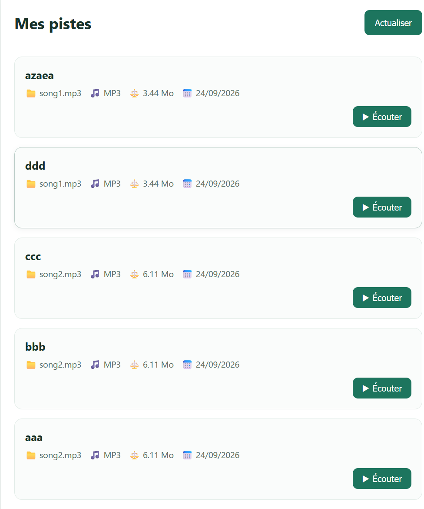
    - Requête audio `GET /api/tracks/:id/audio` (200, JWT) : [`tp2_07_audio_stream_jwt_network.png`](docs/screenshots/tp2_07_audio_stream_jwt_network.png)  
      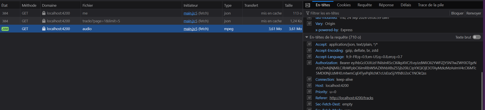
    - Balise `<audio src="blob:http://...">` dans le DOM : [`tp2_08_audio_blob_dom.png`](docs/screenshots/tp2_08_audio_blob_dom.png)  
      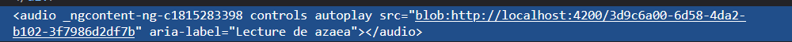
    - Badge « EN ÉCOUTE » et bouton Rejouer : [`tp2_09_audio_playing_badge_ui.png`](docs/screenshots/tp2_09_audio_playing_badge_ui.png)  
      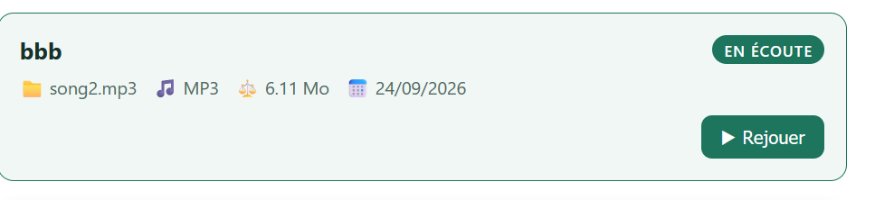
    - Message d'erreur en cas d'échec de récupération audio : [`tp2_10_audio_error_message_ui.png`](docs/screenshots/tp2_10_audio_error_message_ui.png)  
      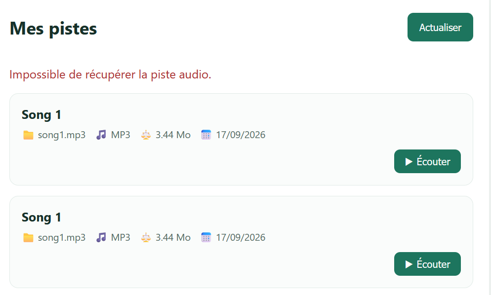
- **Ce que je sais expliquer sans l'agent :**
  - **Pourquoi pas `<audio src="/api/tracks/:id/audio">` ?** La balise HTML standard émet une requête HTTP GET native sans pouvoir y adjoindre l'en-tête `Authorization: Bearer <token>`. Le backend renverrait immédiatement un statut `401 Unauthorized`. Il faut donc passer par `HttpClient` pour injecter le token, récupérer les octets binaires (`Blob`), et générer une URL locale en mémoire.
  - **Pourquoi révoquer les ObjectURL ?** Chaque appel à `URL.createObjectURL()` alloue un pointeur mémoire non nettoyable automatiquement. Sans `URL.revokeObjectURL()`, la mémoire RAM du navigateur fuite à chaque écoute.
  - **Données BDD vs disque :** MongoDB conserve les métadonnées légères (titres, durées, propriétaire) idéales pour la recherche. Les fichiers binaires lourds restent sur le disque du serveur (`data/uploads/`).

---

## Options Avancées du TP2

### 1. Angular Material Paginator & Filtre par titre

- **Objectif :** Remplacer les boutons de pagination basiques par le composant professionnel `MatPaginator` (avec sélecteur de taille 5/10/20) et implémenter un filtre de recherche par titre avec `debounceTime` pour éviter les requêtes intempestives.
- **Prompts principaux :**
  - *Material Paginator :*
    > « Implémente l’option avancée Angular Material Paginator sur la bibliothèque de pistes.  
    > Vérifie les versions d’Angular et d’Angular Material effectivement installées. Si Material est absent, propose la dépendance compatible avant installation. Utilise la documentation correspondant à la version retenue.  
    > Examine la réponse réelle de GET /api/tracks. Détermine si elle fournit le nombre total de pistes, nécessaire pour renseigner correctement length. Si elle ne fournit que pages, ne fabrique pas un total trompeur : explique le blocage et propose la plus petite évolution de contrat, puis attends mon GO.  
    > Remplace les boutons « Précédent » et « Suivant » par MatPaginator, sans remplacer la pagination serveur par une pagination locale.  
    > Convertis correctement pageIndex de Material, qui commence à 0, vers page de l’API, qui commence à 1. Quand pageSize change, reviens à la première page et lance une nouvelle requête.  
    > Préserve les états loading, erreur et liste vide. Rends le paginator accessible, avec un libellé compréhensible ; adapte ses libellés en français si c’est cohérent avec le projet.  
    > Teste les changements de page, de taille de page, les bornes et les paramètres HTTP réellement envoyés. Termine par une vérification à effectuer dans Network. »
  - *Filtre par titre :*
    > « Étudie puis implémente un filtre par titre compatible avec la pagination serveur.  
    > Commence par vérifier si GET /api/tracks accepte déjà un paramètre de recherche. Si ce n’est pas le cas, ne filtre pas uniquement les pistes de la page courante en prétendant filtrer toute la bibliothèque. Propose d’abord la plus petite extension du contrat API et du backend, sa documentation et ses tests, puis attends mon GO.  
    > Si la recherche serveur existe ou si j’ai validé son ajout : ajoute un champ de recherche accessible, limite les requêtes déclenchées pendant la saisie, annule ou ignore les réponses obsolètes, réinitialise la pagination à la page 1 lors d’un changement de filtre et conserve le filtre quand l’utilisateur change de page. Teste les paramètres HTTP, le résultat vide et les requêtes concurrentes. »
- **Plan proposé par l'agent :**
  1. Intégration de `MatPaginatorModule` dans `TracksPageComponent`.
  2. Internationalisation française des libellés via `MatPaginatorIntl` (`getFrenchPaginatorIntl()`).
  3. Conversion d'index : `pageIndex` (base 0 dans Material) vers `page` (base 1 dans l'API).
  4. Champ de recherche réactif avec `FormControl`, opérateur `debounceTime(300)` et réinitialisation à la page 1 lors d'une saisie.
- **Vérifications réalisées (étudiant) :**
  - Changement de la taille de page (5 vers 10 pistes) : nouvelle requête émise avec `limit=10` et retour immédiat à la première page.
  - Saisie d'une recherche : aucune requête émise pendant la frappe rapide, puis émission propre de `GET /api/tracks?page=1&limit=5&title=...` après 300 ms.
- **Preuve de fonctionnement :**
  - Composant `MatPaginator` (5 pistes par page) : [`tp2_11_mat_paginator_limit5_ui.png`](docs/screenshots/tp2_11_mat_paginator_limit5_ui.png)  
    
  - Sélecteur de taille de page (10 pistes par page) : [`tp2_12_mat_paginator_limit10_ui.png`](docs/screenshots/tp2_12_mat_paginator_limit10_ui.png)  
    
  - Requêtes HTTP émises dynamiquement lors du changement : [`tp2_13_mat_paginator_network.png`](docs/screenshots/tp2_13_mat_paginator_network.png)  
    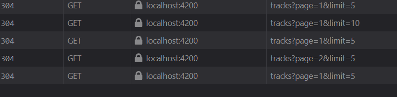
  - Requête filtrée `GET /api/tracks?title=d` : [`tp2_bonus_filter_title_d_network.png`](docs/screenshots/tp2_bonus_filter_title_d_network.png)  
    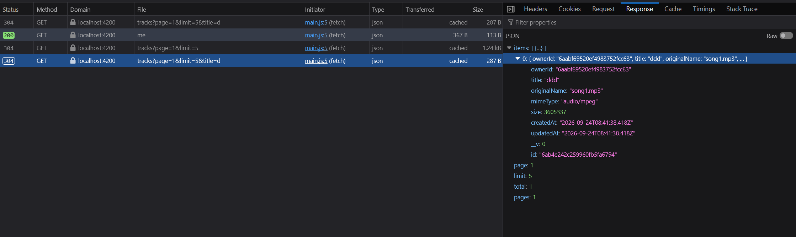
  - Requête filtrée `GET /api/tracks?title=song` : [`tp2_bonus_filter_title_song_network.png`](docs/screenshots/tp2_bonus_filter_title_song_network.png)  
    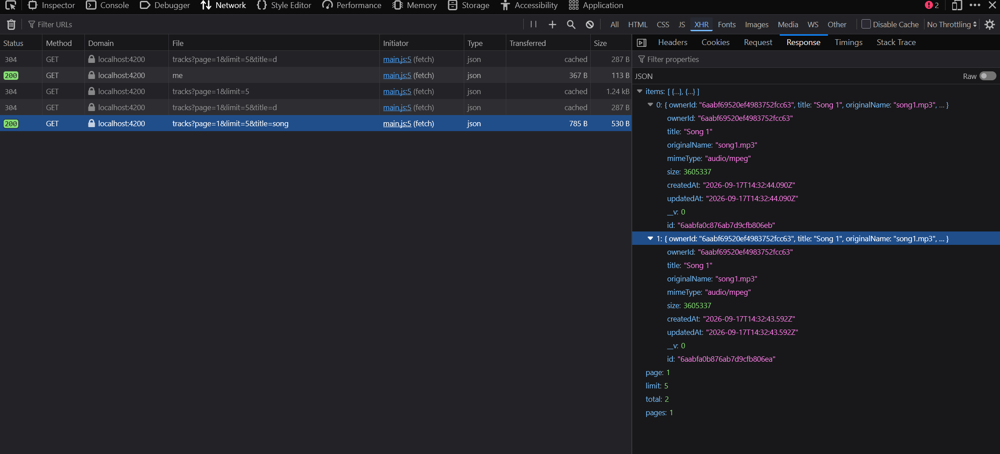

---

### 2. Mongoose `aggregate-paginate-v2` (Variante A)

- **Objectif :** Remplacer la double requête MongoDB (`find` + `countDocuments`) par un pipeline d'agrégation atomique utilisant `$facet`, garantissant un comptage cohérent, un tri déterministe et une étanchéité multi-utilisateurs stricte.
- **Prompt principal :**
  > « GO pagination Mongoose, variante [A].  
  > Implémente uniquement la variante approuvée. Applique le plugin correctement au schéma et assure une pagination sur les pistes du propriétaire authentifié, avec comptage cohérent, paramètres bornés et tri déterministe. Mets à jour API_CONTRACT.md, le frontend et les tests si le contrat change.  
  > Ajoute des tests backend avec plusieurs utilisateurs et plusieurs pages : aucun morceau ni total d’un autre utilisateur ne doit apparaître. Teste aussi page/limit invalides, page vide, tri et compatibilité du frontend. Exécute les tests pertinents et résume les changements observables dans Network. »
- **Plan proposé par l'agent :**
  1. Branchement du plugin `mongoose-aggregate-paginate-v2` sur `TrackSchema` dans `backend/src/models/Track.js`.
  2. Construction du pipeline d'agrégation dans `backend/src/app.js` avec étape `$match: { ownerId: ownerObjectId }`.
  3. Tri composite déterministe `{ createdAt: -1, _id: -1 }`.
  4. Exposition des métadonnées de pagination complètes (`total`, `pages`, `hasPrevPage`, `hasNextPage`).
- **Vérifications réalisées (étudiant) :**
  - Contrôle backend : 20 tests passants validant l'isolation absolue entre comptes utilisateurs.
  - Inspection de la réponse Network : présence des métadonnées étendues de pagination.
- **Preuve de fonctionnement :**
  - Réponse Mongoose `aggregate-paginate-v2` (`$facet`) : [`tp2_bonus_aggregate_paginate_response.png`](docs/screenshots/tp2_bonus_aggregate_paginate_response.png)  
    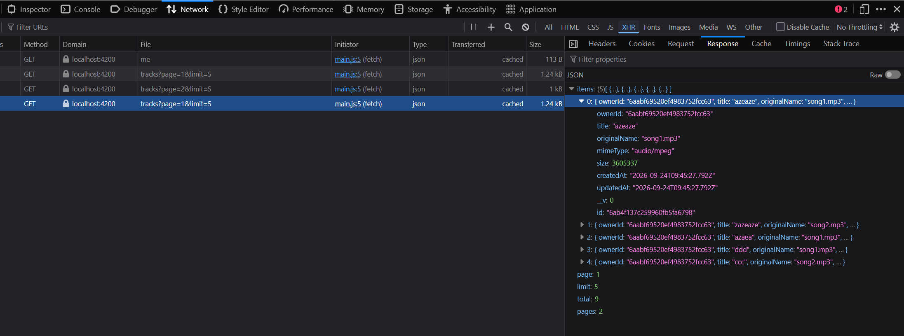
  - En-têtes HTTP de la route agrégée : [`tp2_bonus_aggregate_paginate_headers.png`](docs/screenshots/tp2_bonus_aggregate_paginate_headers.png)  
    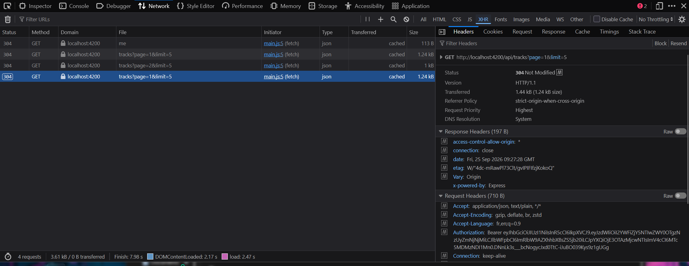

---

### 3. Image de couverture par piste (Approche A : Upload utilisateur)

- **Objectif :** Permettre l'ajout d'une image de couverture facultative (JPEG, PNG, WebP $\le$ 2 Mo) par piste, avec validation par signature binaire (magic bytes), flux sécurisé sous JWT, remplacement sans orphelin et suppression propre.
- **Prompt principal :**
  > « GO couverture — approche A : image uploadée par l’utilisateur.  
  > Implémente le contrat validé après l’étude 7A. Autorise une image facultative par piste, avec un format et une taille maximale clairement définis côté frontend et backend. Valide le contenu réel du fichier côté serveur plutôt que de te fier uniquement à son extension ou au type MIME déclaré. Stocke l’image selon l’architecture retenue et ne l’expose qu’aux utilisateurs autorisés si les pistes sont privées.  
  > Prévois une image par défaut, le remplacement et la suppression sans fichiers orphelins. Mets à jour API_CONTRACT.md et teste validation, accès propriétaire, absence de couverture et nettoyage des fichiers. Ne change pas le flux audio existant. »
- **Plan proposé par l'agent :**
  1. Validation serveur stricte par magic bytes (`backend/src/utils/imageValidator.js`) pour analyser les premiers octets et bloquer les faux fichiers renommés.
  2. Routes backend dédiées : `GET /api/tracks/:id/cover`, `PUT /api/tracks/:id/cover`, `DELETE /api/tracks/:id/cover`.
  3. Côté frontend, sélection avec prévisualisation immédiate en ObjectURL, affichage d'un vinyle par défaut (`default-cover.svg`), remplacement et suppression de couverture.
  4. Suppression physique systématique de l'ancien fichier sur le disque du serveur lors d'un remplacement ou d'une suppression.
- **Vérifications réalisées (étudiant) :**
  - Upload d'un morceau avec pochette : affichage immédiat de l'illustration sur la carte.
  - Remplacement de pochette : vérification que l'ancien fichier image est bien supprimé de `backend/data/uploads/covers/`.
  - Piste sans image : fallback automatique vers l'icône de vinyle par défaut sans erreur 404 dans la console.
- **Preuve de fonctionnement :**
  - Prévisualisation miniature de la pochette lors de l'upload : [`tp2_bonus_cover_upload_preview_ui.png`](docs/screenshots/tp2_bonus_cover_upload_preview_ui.png)  
    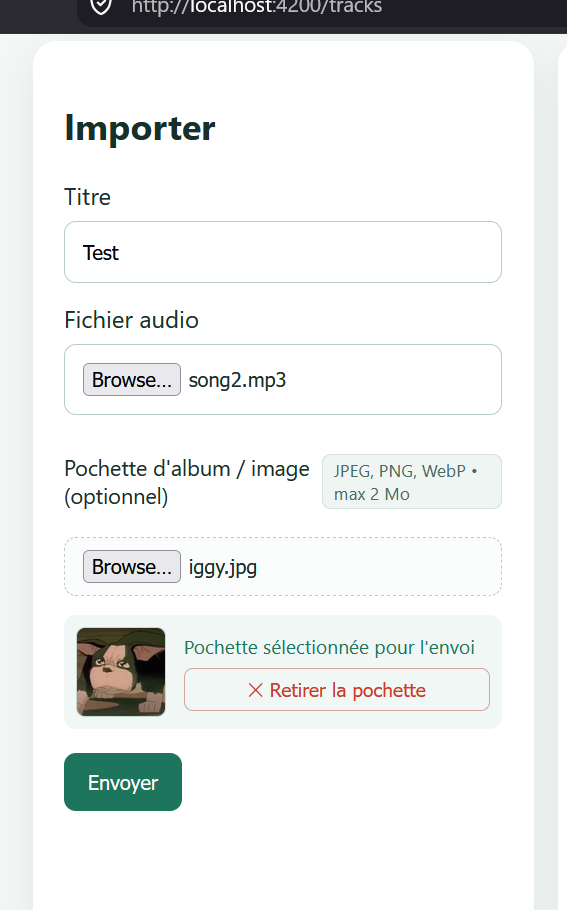
  - Requête sécurisée `GET /api/tracks/:id/cover` sous JWT : [`tp2_bonus_cover_get_jwt_network.png`](docs/screenshots/tp2_bonus_cover_get_jwt_network.png)  
    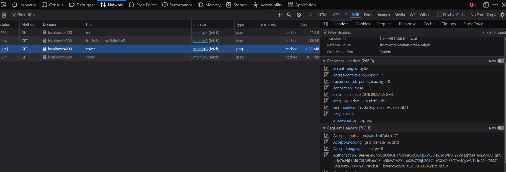
  - Requête `PUT /api/tracks/:id/cover` pour le remplacement de couverture : [`tp2_bonus_cover_put_update_network.png`](docs/screenshots/tp2_bonus_cover_put_update_network.png)  
    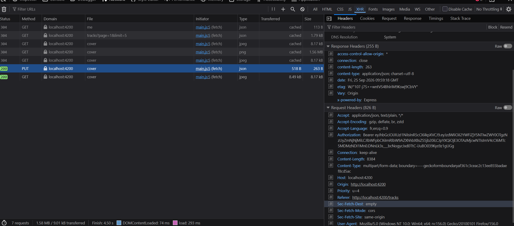
  - Vue d'ensemble de l'interface complète du portail : [`tp2_bonus_full_ui_overview.png`](docs/screenshots/tp2_bonus_full_ui_overview.png)  
    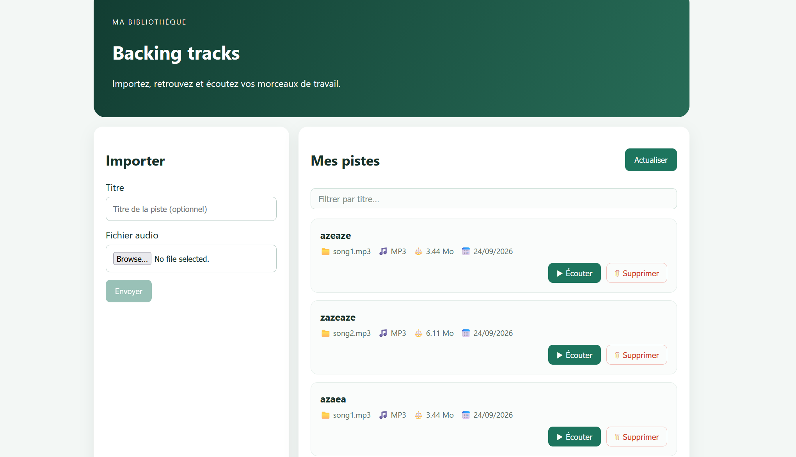

---

# TP3 — Fiabilisation et Enrichissement du Frontend

## Étape 0 — Cadrage et Audit initial

- **Objectif :** Examiner l'architecture existante issue des TP1 et TP2, identifier les composants clés (`TracksPageComponent`, `TrackService`, intercepteurs, guards), vérifier les prérequis Angular Material (`MatSnackBar`), analyser le comportement de `DELETE /api/tracks/:id` et recenser l'ensemble des suites de tests avant toute modification.
- **Prompts principaux :**
  - *Cadrage général :*
    > « Nous allons réaliser le TP3 progressivement. Travaille mission par mission et attends mon GO avant de passer à la suivante.  
    > Préserve les fonctionnalités des TP1 et TP2 : connexion, profil, pagination serveur, upload et lecture audio authentifiée. Le backend reste inchangé pour les missions obligatoires.  
    > Avant toute modification, inspecte le dépôt réel, API_CONTRACT.md, les versions installées et les tests existants. N’invente pas de fichiers, de réponses API ou de résultats de tests. Réutilise ce qui fonctionne déjà, notamment si la suppression ou la progression d’upload a été implémentée pendant le TP2.  
    > Respecte les conventions Angular du projet : composants standalone, inject(), Signals, contrôle de flux natif, typage strict sans any. Aucun mot de passe ni JWT dans les logs, l’interface ou les captures.  
    > Pour chaque mission, indique : existant, manques, fichiers modifiés, tests exécutés, résultats observés et vérifications manuelles restantes. Commence uniquement par l’audit, sans coder. »
  - *Audit Étape 0 :*
    > « Étape 0 : audit uniquement. Ne modifie aucun fichier.  
    > Identifie le composant des cards, le composant d’upload, TrackService, l’intercepteur d’authentification et les éventuels guards.  
    > Relis API_CONTRACT.md pour DELETE /api/tracks/:id et POST /api/tracks.  
    > Vérifie si MatSnackBar et Angular Material sont déjà installés et configurés.  
    > Vérifie si la suppression, la confirmation et la progression d’upload existent déjà depuis le TP2. Distingue « présent », « incomplet » et « absent ».  
    > Vérifie la configuration HTTP utilisée pour l’upload : elle doit permettre les événements de progression.  
    > Recense les tests frontend/backend et les commandes réelles pour les lancer.  
    > Remets-moi un tableau des manques par mission, avec les fichiers concernés. Signale les divergences entre le sujet et le code. Attends mon GO. »
- **Plan proposé par l'agent :**
  1. Inspection sans modification de code du frontend et du backend.
  2. Établissement d'un inventaire complet des fonctionnalités existantes et manquantes.
  3. Validation des dépendances Angular Material déjà installées.
  4. Proposition d'un plan d'action validé (Option A : intégration de `MatSnackBar` pour les toasts d'upload et de suppression).
- **Vérifications réalisées (étudiant) :**
  - Vérification de la présence de `@angular/material` dans `package.json`.
  - Contrôle du contrat API pour `DELETE /api/tracks/:id` (suppression sans orphelins : BDD, audio et couverture).

---

## Mission 5 — Suppression d’une piste

- **Objectif :** Permettre la suppression d'une piste via `DELETE /api/tracks/:id` avec confirmation préalable (`window.confirm`), blocage anti-double clic via Signal `deletingTrackId`, stratégie pessimiste, notification toast `MatSnackBar`, recul automatique d'une page si la dernière devient vide, arrêt du lecteur si la piste jouait, et gestion de l'erreur 404 si la piste n'existe plus ou appartient à un tiers.
- **Prompts principaux :**
  - *Implémentation initiale :*
    > « Implémente la suppression d’une piste avec confirmation via DELETE /api/tracks/:id.  
    > Avant de coder, vérifie que cette route existe réellement, qu’elle est protégée et que son comportement pour une piste appartenant à un autre utilisateur est défini. Vérifie aussi comment le backend gère la suppression du fichier audio sur disque. Si ces points sont absents ou ambigus, présente-les et attends mon GO : n’invente pas le contrat.  
    > Si le contrat est confirmé, ajoute une action « Supprimer » accessible sur la card, demande confirmation, bloque les doubles clics pendant l’opération, affiche le succès ou l’erreur et rafraîchis la page courante depuis le serveur. Si la suppression vide la dernière page, reviens à la page précédente valide.  
    > N’efface jamais la piste de l’interface avant confirmation du succès serveur, sauf si tu proposes explicitement une stratégie optimiste et que je l’approuve. Teste annulation, succès, erreur, double clic, refus d’accès et dernière page devenue vide. »
  - *Finalisation TP3 :*
    > « je crois que le TP 3 est déjà fait, peux-tu me le confirmer stp » $\rightarrow$ validation « Option A » (intégration de `MatSnackBar` pour les notifications toasts de suppression et d'upload afin de parfaire la conformité).
- **Plan proposé par l'agent :**
  1. Injection de `MatSnackBar` via `inject(MatSnackBar)`.
  2. Ajout du bouton « Supprimer » sur chaque carte de morceau.
  3. Demande de confirmation préalable via `window.confirm()`.
  4. Signal `deletingTrackId` bloquant tout double clic pendant la requête réseau.
  5. Appel de `TrackService.delete(id)` et gestion pessimiste (la carte reste à l'écran jusqu'à confirmation serveur).
  6. En cas de succès : affichage du toast `MatSnackBar` (4s), arrêt du lecteur audio si la piste jouait, calcul du recul de page si la dernière est devenue vide, et appel de `this.load()`.
  7. En cas d'échec (404) : affichage du toast d'erreur `MatSnackBar` (5s) et déblocage de l'état sans crash.
- **Vérifications réalisées (étudiant) :**
  - Clic sur « Supprimer » puis « Annuler » : aucun appel réseau émis, la piste reste affichée.
  - Clic sur « Supprimer » puis « Confirmer » : notification toast de succès en bas de l'écran, suppression de la carte et rafraîchissement depuis le serveur.
  - Clic rapide répété : impossibilité de déclencher deux requêtes simultanées grâce au signal `deletingTrackId`.
- **Fichiers modifiés :**
  - `src/app/components/tracks-page/tracks-page.ts` : méthode `deleteTrack()`, injection `MatSnackBar`, gestion du recul de page et nettoyage audio.
  - `src/app/components/tracks-page/tracks-page.html` : bouton accessible « Supprimer » sur chaque carte.
  - `src/app/components/tracks-page/tracks-page.spec.ts` : tests unitaires mockant `MatSnackBar` et validant l'ensemble des scénarios.
- **Preuve de fonctionnement :**
  - 9 tests unitaires dédiés à la suppression, tous passants.
  - **Captures visuelles :**
    - Boutons « Supprimer » sur chaque carte de morceau : [`tp3_02_delete_buttons_cards_ui.png`](docs/screenshots/tp3_02_delete_buttons_cards_ui.png)  
      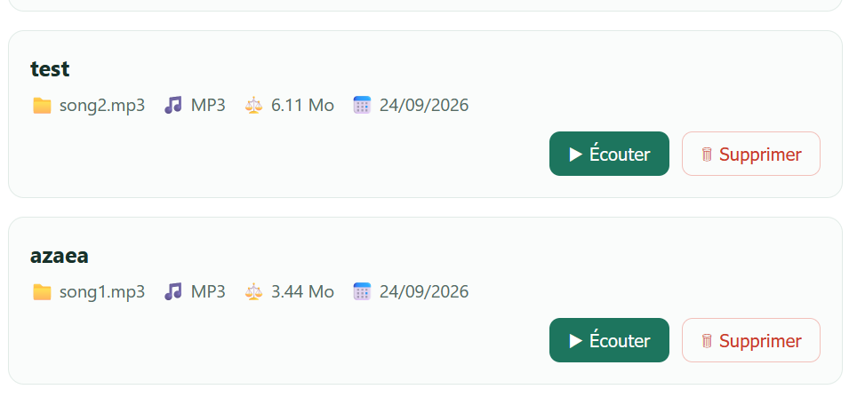
    - Boîte de dialogue de confirmation préalable : [`tp3_03_delete_confirm_dialog_ui.png`](docs/screenshots/tp3_03_delete_confirm_dialog_ui.png)  
      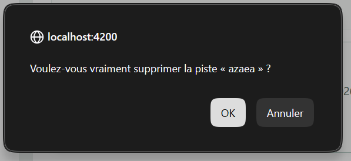
    - Notification toast `MatSnackBar` de confirmation de suppression : [`tp3_04_delete_snack_bar_toast_ui.png`](docs/screenshots/tp3_04_delete_snack_bar_toast_ui.png)  
      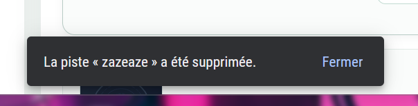
- **Ce que je sais expliquer sans l'agent :**
  - **Pourquoi la suppression passe par un service ?** Pour découpler l'affichage de la logique HTTP. Le composant gère les interactions et la vue, `TrackService` gère l'appel `DELETE` et le typage, facilitant les tests unitaires.
  - **Pourquoi le guard ne suffit pas à sécuriser la suppression ?** Le guard Angular s'exécute côté client dans le navigateur et peut être contourné avec curl ou Postman. C'est le backend qui assure la sécurité réelle en déchiffrant le JWT et en filtrant MongoDB avec `Track.findOneAndDelete({ _id: id, ownerId: req.auth.sub })`. Si la piste a été supprimée ailleurs ou appartient à un autre compte, le serveur renvoie 404.

---

## Mission 6 — Progression de l’upload

- **Objectif :** Faire évoluer le formulaire d'upload pour écouter les événements réseau en temps réel, calculer et afficher le pourcentage d'avancement (0 à 100%) via une barre de progression accessible, et distinguer nettement le transfert des octets de la validation serveur finale.
- **Prompt principal :**
  > « Ajoute une barre de progression à l’upload existant, sans réécrire le formulaire ni changer les champs multipart audio et title.  
  > Inspecte d’abord la configuration de HttpClient et l’implémentation actuelle de TrackService.upload(). Vérifie si des événements de progression d’upload peuvent effectivement être obtenus avec cette configuration.  
  > Si oui, utilise les événements HTTP adaptés pour afficher la progression quand le total est connu. Distingue clairement « octets envoyés » et « traitement terminé par le serveur » : ne présente pas 100 % d’envoi comme une réussite tant que la réponse HTTP de succès n’est pas reçue. Si le total n’est pas disponible, affiche un état indéterminé.  
  > Préserve la validation du fichier, le blocage des doubles soumissions, les erreurs serveur, le message de succès et le retour à la première page. Ajoute les tests des événements de progression, du succès final et de l’échec. Si la configuration HTTP actuelle ne permet pas la progression, explique la modification minimale nécessaire et attends mon GO avant de changer cette configuration. »
- **Plan proposé par l'agent :**
  1. Configuration de l'appel HTTP dans `TrackService.upload()` avec les options `{ reportProgress: true, observe: 'events' }`.
  2. Écoute des événements `HttpEventType.UploadProgress` dans `tracks-page.ts`.
  3. Calcul dynamique du pourcentage : `Math.round((event.loaded / event.total) * 100)`.
  4. Gestion de 4 états visuels distincts : inactif, envoi en cours avec pourcentage, traitement serveur en cours (à 100% réseau), et succès final à la réception de `HttpEventType.Response`.
  5. Notification de succès ou d'erreur finale via toast `MatSnackBar`.
- **Vérifications réalisées (étudiant) :**
  - Upload d'un fichier audio volumineux : observation de la progression fluide de la barre de 0% à 100%.
  - Observation de l'état intermédiaire « Envoi terminé. Traitement par le serveur en cours… » avant la réponse HTTP 201.
  - Vérification de l'ouverture du toast `MatSnackBar` dès la validation serveur.
- **Fichiers modifiés :**
  - `src/app/shared/services/track.service.ts` : configuration de l'appel d'upload avec `reportProgress` et `observe: 'events'`.
  - `src/app/components/tracks-page/tracks-page.ts` : traitement des événements `HttpEventType`, calcul du pourcentage, signaux `uploadProgress` et `uploadStatusText`.
  - `src/app/components/tracks-page/tracks-page.html` : élément barre de progression stylisé avec attributs d'accessibilité ARIA (`role="progressbar"`, `aria-valuenow`).
  - `src/app/components/tracks-page/tracks-page.spec.ts` : tests unitaires simulant les événements de progression et la réponse finale.
- **Preuve de fonctionnement :**
  - **Capture visuelle :**
    - Barre de progression animée pendant le transfert : [`tp3_01_upload_progress_bar_ui.png`](docs/screenshots/tp3_01_upload_progress_bar_ui.png)  
      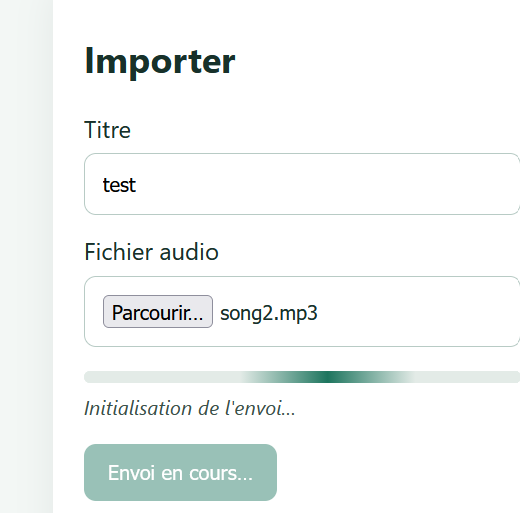
- **Ce que je sais expliquer sans l'agent :**
  - **Comment Angular calcule le pourcentage ?** Grâce à l'option `reportProgress: true` sous RxJS. Angular émet des événements intermédiaires `HttpEventType.UploadProgress` contenant le nombre d'octets transférés (`loaded`) et la taille totale (`total`). Le pourcentage vaut : `Math.round((event.loaded / event.total) * 100)`.
  - **Distinction transfert réseau vs succès serveur :** Atteindre 100% signifie uniquement que les octets ont quitté le navigateur. Le serveur doit encore vérifier le fichier avec Multer, valider les magic bytes, écrire sur disque et enregistrer le document en BDD. La réussite ne doit être confirmée qu'à la réception de l'événement final `HttpEventType.Response` (statut HTTP 201).

---

## Mission 7 — Tests automatisés et Build

- **Objectif :** Valider l'intégralité de la chaîne de tests frontend et backend et s'assurer que le bundle de production compile sans aucune erreur ni régression.
- **Commandes exécutées et résultats :**
  - Frontend : `npm test -- --watch=false` dans `frontend-starter/` $\rightarrow$ **100 tests passés avec succès sur 100**.
  - Backend : `npm test` dans `backend/` $\rightarrow$ **20 tests passés avec succès sur 20**.
  - Build de production : `npm run build` dans `frontend-starter/` $\rightarrow$ Compilation réussie sans erreur (bundle initial `main.js` : 631 kB).
- **Ce que je sais expliquer sans l'agent :**
  - **Pourquoi les tests HTTP n’ont pas besoin de MongoDB ?** Parce qu'ils s'appuient sur `provideHttpClientTesting()` et `HttpTestingController`. Ces outils interceptent les requêtes HTTP dans le runtime de test et injectent des réponses factices (`req.flush()`). Ni le serveur Node.js ni la base Atlas ne sont sollicités.
  - **Ce que vérifie un test d'intercepteur ou de guard :**
    - L'intercepteur vérifie que l'en-tête `Authorization: Bearer <token>` est bien greffé sur les requêtes protégées et qu'une erreur 401 purge la session.
    - Le guard vérifie que l'accès à une route est accordé si un token valide existe, ou redirige vers `/login` dans le cas contraire.
  - **Différence entre test unitaire et test d’intégration :**
    - *Test unitaire :* Teste une classe ou un composant isolé en remplaçant toutes ses dépendances par des simulations ou mocks (ex : tester `TracksPageComponent` avec un mock de `TrackService`).
    - *Test d'intégration :* Teste la collaboration réelle de plusieurs briques ensemble (composants, services, DOM) pour s'assurer que le flux global fonctionne sans rupture.
